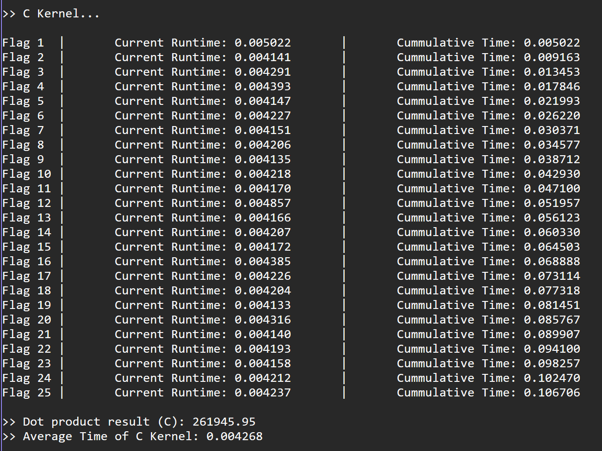
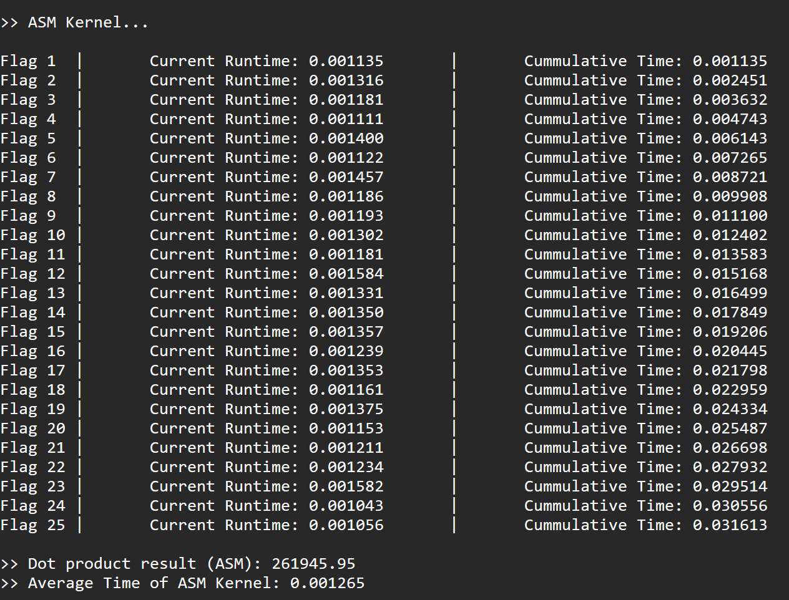
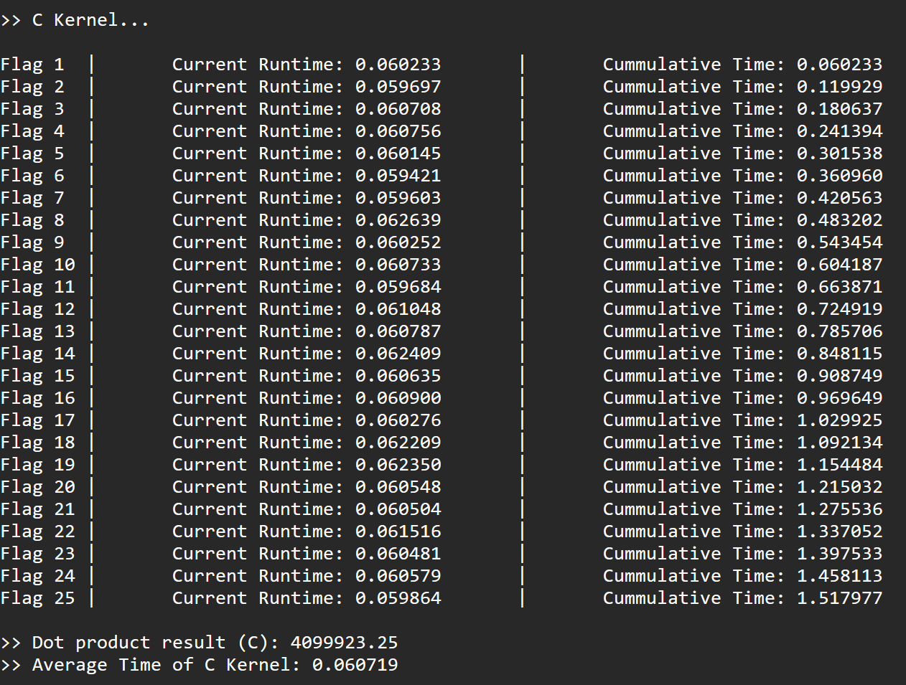
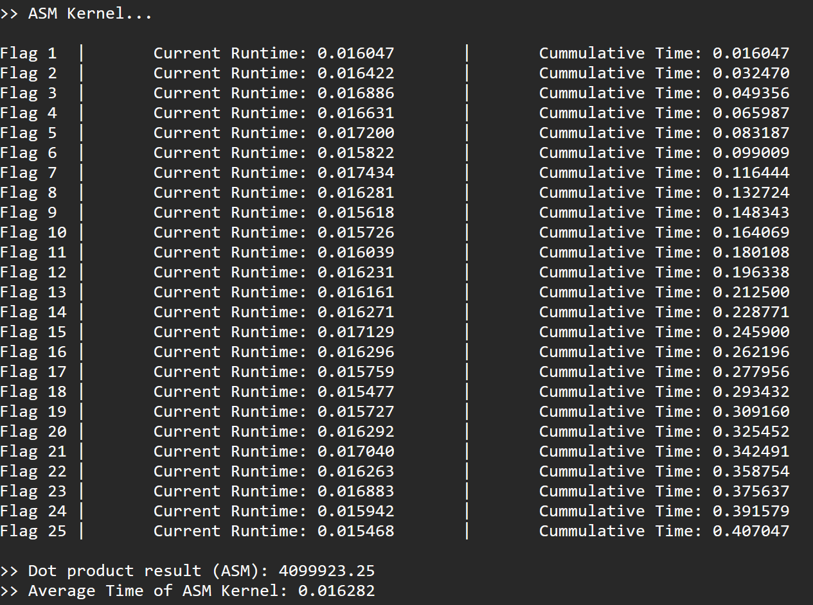
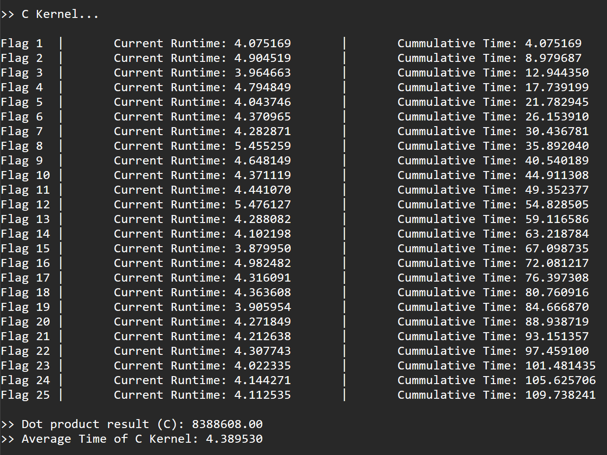
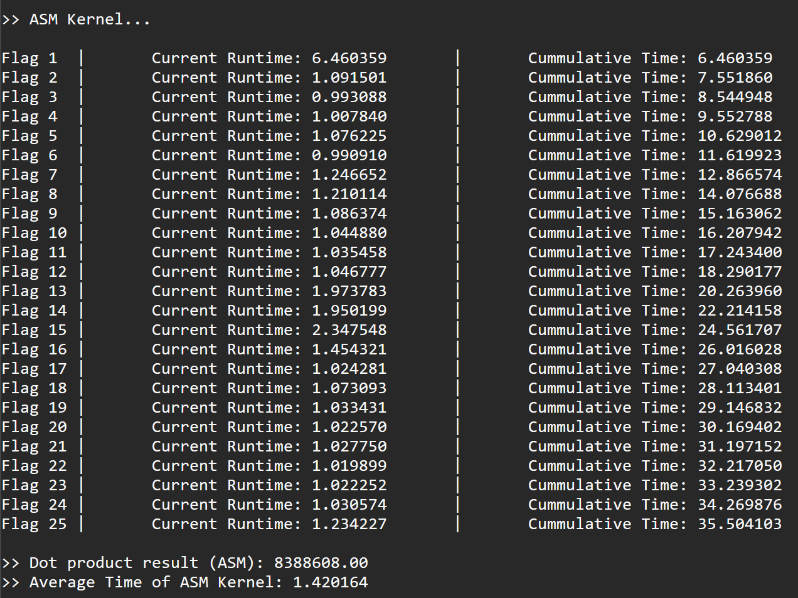

# LBYARCH-MCO2
Repository for LBYARCH MCO2

**Group Members**:
- CHUA, Hanielle Jermayn E.
- KELSEY, Gabrielle Madison F.
- TOLENTINO, Hephzi-Bah G.
---
## To run:
```
nasm -f win64 asmsdot.asm
gcc -c main.c -o main.obj -m64
gcc sdot.c timer.c main.obj asmsdot.obj -o main.exe -m64
main.exe
```

---
## Comparative Analysis

### 1. Vector Size = 2^20

**C Kernel**  




**x86-64 Assembly Kernel**

 

When the vector size is 2^20, the runtime difference between the two kernels is negligible. The C kernel has an average runtime of **~0.004268** seconds, while the ASM kernel has an average runtime of **~0.001265** seconds. At this scale, both implementations execute fast enough that their disparity in performance is barely noticeable.

### 2. Vector Size = 2^24

**C Kernel**  




**x86-64 Assembly Kernel**

 

When the vector size increases to 2^24, the runtimes remain relatively close, although the ASM kernel begins to show a small advantage. The C kernel averages **~0.0607** seconds, whereas the ASM kernel completes in **~0.0162** seconds. The gap becomes more visible, but both kernels still maintain fairly efficient execution.

### 3. Vector Size = 2^30

**C Kernel**  




**x86-64 Assembly Kernel**

 

When the vector size reaches 2^30, the difference becomes significant. The average runtime of the C kernel rises to approximately **~4.39** seconds, while the ASM kernel completes the same workload in roughly **~1.42** seconds. At this scale, the performance gap grows dramatically, demonstrating that the larger the vector size, the more substantial the performance divergence becomes. The ASM kernel maintains relatively consistent efficiency with minimal variation across different vector sizes, while the C kernel exhibits a noticeably faster rate of growth in proportion to the size of the vector.

---
## C Kernel Sample Output

**Vector Size**: 1073741824  
**Vector A** (first 5): 0.61, 0.26, 0.74, 0.02, 0.47, ...  
**Vector B** (first 5): 0.11, 0.76, 0.24, 0.52, 0.97, ...

  

---
## x86-64 Assembly Kernel Sample Output

**Vector Size**: 1073741824  
**Vector A** (first 5): 0.61, 0.26, 0.74, 0.02, 0.47, ...  
**Vector B** (first 5): 0.11, 0.76, 0.24, 0.52, 0.97, ...  

  